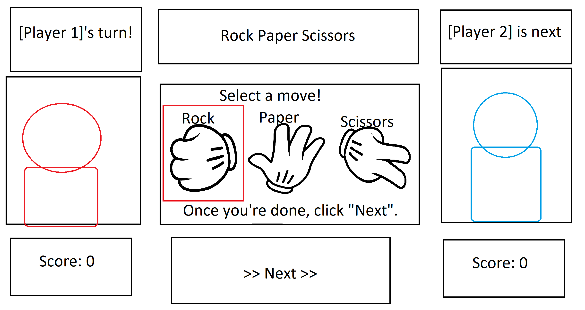

# Rock Paper Scissors Web Game
# header 1: A simple Rock Paper Scissors game for web browsers, meant for two players. 
---
Mock up below
---

Here we have the very start of the page. Users will be asked to enter their names for "player 1" and "player 2". The game begins once you click "START!". If no names are entered, it will just use the default values "Player 1" and "Player 2". As this is a local multiplayer game meant for two players sharing a computer, I thought to include a blurb to ask the players not to cheat by watching their opponent play...

After the users click "Start", the game will randomly decide who will go first in the interest of fairness. This first player picks a hand, then once they're sure they picked what they wanted, they click "Next".

Now that the first player has made their play, the second player has their turn come up. Whatever the first player picked won't be revealed until the second player makes their move, and we use a question mark image to show this to the users. 

Here we have the results! Whoever picked the winning move is titled the winner, and their score increases by one. There are two options to proceed -- keep playing, or quit.

Here's what happens if the users keep playing. The score is carried over from the previous round, and the loser of the last round gets to make the first move here. From here, the process is the same as before.

Here's what happens if the users choose to quit. An alert shows up, letting the players know they chose to quit the game. The score will be reset, and upon clicking confirm, the page is refreshed and the scores are set to 0, and the names need to be re-entered. If they click cancel, it will take the user back to the choice to quit or keep playing.